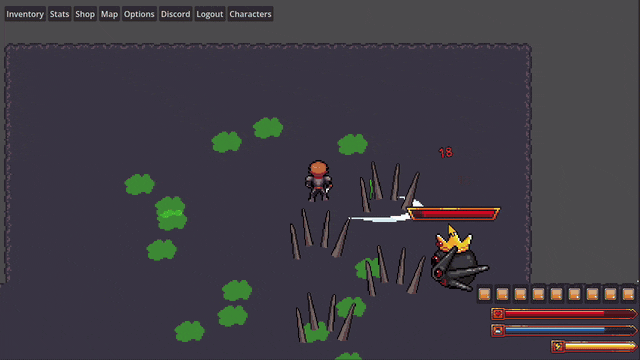

# Elusion RPG

A top-down 2.5D action RPG built in Godot 4.6 with GDScript, backed by a Flask account service. Four playable classes, seven enemy types, collectable combat pets, fishing and cooking, and a complete run from town to final boss.



*The boss telegraphs in red, then erupts. Two attack tracks run on separate timers and never sync, so the pattern you are dodging is emergent rather than authored — and each spike leads you by its own telegraph time, which means a volley deforms in flight instead of landing where you were.*

## The run

Register or log in → pick one of four class slots → town → leave town for the field → take the ladder down to the boss floor → defeat the boss → easter egg → game over → restart at town.

It is short on purpose. It has a beginning, an escalation, an ending, and a loop back to the start.

## What's interesting in here

The parts I'd point a reviewer at first.

### The client does not own the save — `src/systems/savestorage.gd`, `src/systems/serverstorage.gd`

`CharacterData` holds a `SaveStorage` and never asks which implementation it has. That seam is what let the game move from a local file to the Flask service without touching the twenty-nine places that call `save_data()`. The server is the authority now — it owns level, XP, the derived stat maxima and every loot roll — so the anti-tamper passes that existed to defend a local file against a text editor are skipped rather than run against data they can no longer say anything useful about. Writes are still debounced: saving on every stat change was firing about twenty times a second in normal play.

### Enemies that form up instead of stacking — `src/enemies/baseenemy.gd`

Pathfinding runs on `NavigationRegion2D`, but the interesting part is slot claiming: each enemy reserves a specific tile in the ring around the player and paths to that, so a group arranges itself around you rather than piling into one spot. Movement stays strictly 4-directional despite using real pathfinding underneath.

### One entity, two forms — `src/enemies/poisonslime.gd`

The poison slime duplicates once when you get close, then each copy converts into four smaller slimes at half health. Large and small are the same scene and the same script — a single `is_small` flag selects the animation set, the projectile, the stat block, and whether the duplicate and split paths are available at all. Its acid leaves ground hazards that stack, so the fight is about position rather than damage.

### Real accounts, not a local profile gate — `src/systems/api.gd`

Passwords are salted and hashed server-side; the client holds a bearer token and never sees a hash. Login and "no such user" return an identical 401 so the endpoint can't be used to enumerate usernames. Admin is a database column, not a username comparison running on the player's own machine.

### Composition where inheritance would have been wrong — `src/pets/pet.gd`

A pet is a shrunk, ally-flipped enemy, so inheriting `BaseEnemy` looks obvious. It isn't: a pet follows an owner and picks targets, an enemy chases and leashes home. `Pet` is its own `CharacterBody2D` with every combat value exported, and the two share nothing but a shape.

### Frame-accurate combat — `src/enemies/bushsniper.gd`, `src/enemies/poisonslime.gd`

Projectiles are released on a specific animation frame rather than at the start of the swing, so the shot leaves the sprite at the moment the art throws it.

### Gathering that the server owns outright — `src/world/fishingspot.gd`, `src/ui/cooking/cookingscreen.gd`

Fishing and cooking are the first two skills the client cannot lie about. The rod and bait are checked, the catch is rolled and the XP granted by the server against items it consumed itself; `PUT /api/character/skills` then *drops* fishing and cooking from whatever the client sends, because a client's next routine sync would otherwise overwrite a grant the server just made. The fishing spot draws its own tell — ripples that fade in by proximity — in `_draw()` rather than using art.

### An audit I ran against my own API — `SECURITY_NOTES.md` (API repo)

I attacked my own server as a logged-in player with a modified client and wrote down what I got away with: five findings, each rated, each with a fix. Three are closed, one is partly closed, one is open and stays listed because naming it is the point. The login endpoint that came out of it throttles per account *and* per source address — the second one because eight consecutive misses on one account does nothing about one host trying the same password against a thousand usernames.

### Data-driven items — `src/systems/itemregistry.gd`, `src/systems/itemdata.gd`

`ItemData` resources are scanned from `data/items/` at startup and indexed by id. Item definition (`ItemData`) is deliberately split from instance state (`ItemStack`), so saves store only `{item_id, quantity}` and rehydrate against the registry on load. Drop a new `.tres` in the folder and it exists.

## Layout

```
src/
  characters/    player base + the four classes (warrior, mage, tank, healer)
  enemies/       BaseEnemy and its subclasses, including the multi-phase boss
  pets/          the companion system
  projectiles/   arrows, acid, vines, slash waves, ground hazards
  shared/        facing and formation helpers used by both sides of combat
  systems/       save/load, item registry, API client, game state, audio
  tools/         editor-only: the game-data exporter and the in-engine test runner
  types/         the Resource definitions — ItemData, EnemyData, ClassData, ItemStack
  ui/            HUD, inventory, bank, cooking, character select, login
  world/         ladders, portals, shops, fishing spots, firepits, loot bags
scene/           the .tscn side of all of the above
data/items/      ItemData resources — the item database (122 of them)
data/enemies/    EnemyData resources — stats and drop tables, one per variant
data/classes/    ClassData resources — the per-class stat curves
data/gamedata.json  generated by src/tools/exportgamedata.gd; the server reads it
docs/            design notes
```

Three files carry most of the complexity and are the best places to start reading: `src/enemies/baseenemy.gd` (the shared enemy brain), `src/enemies/bossenemy.gd` (two independent attack tracks that never sync, so what you dodge is emergent rather than authored) and `src/systems/characterdata.gd` (everything a character is, and the seam the server took over).

## Running it

The game: open the project in Godot 4.6 and press <kbd>F5</kbd>.

The account service is a companion Flask app in its own repository. Start it before launching the game — the game expects it at `http://127.0.0.1:5000` (set in `src/systems/api.gd`).

```bat
cd <your-path>\game\api
.\venv\Scripts\python.exe app.py
```

```bash
# macOS / Linux
cd <your-path>/game/api
./venv/bin/python app.py
```

Calling the virtualenv's interpreter directly is deliberate: it skips having to activate the environment and guarantees you're on the venv's Python rather than whatever `python` happens to resolve to on `PATH`.

That serves thirty endpoints — accounts and sessions, character saves, the shared bank, combat kills, loot, fishing and cooking — plus interactive Swagger docs (via flasgger) at `http://127.0.0.1:5000/apidocs`, which is the quickest way to see the whole surface at once.

Note this is Flask's development server (`app.run(debug=True)`), which is right for local play and wrong for anything public; a real deployment would sit behind a WSGI server.

Without the service running, the login screen will tell you it can't reach the server — the game does not fall back to local accounts by design.

## Status

The single-player build is complete and playable start to finish.

Authority has moved off the client. The server rolls every loot drop with entropy the client never sees, owns level and XP and the stat maxima they imply, holds loot bags as rows the game renders a copy of — taking an item out of one is a request, not an announcement — and now reconciles the backpack against what it actually granted, so a modified client's fabricated items are trimmed to nothing.

Two gaps remain, both named and tracked in the API repo's `SECURITY_NOTES.md`: four of the six skills still have no server-side XP grant (fishing and cooking do), and the kill *event* is still asserted rather than verified. Neither is hidden; both have a fix written down.

`devlog.md` records the architecture decisions and the reasoning behind them, including the ones that turned out to be wrong.

## License

Code is MIT licensed — see [LICENSE](LICENSE).

Art, graphics and audio are **not** covered by that license, and some of it belongs to someone else. See [assetlicense.md](assetlicense.md) before doing anything with the files under `art/` or `assets/`. If you'd like to contribute assets, read [docs/ASSET_CONTRIBUTOR_AGREEMENT.md](docs/ASSET_CONTRIBUTOR_AGREEMENT.md) first.
